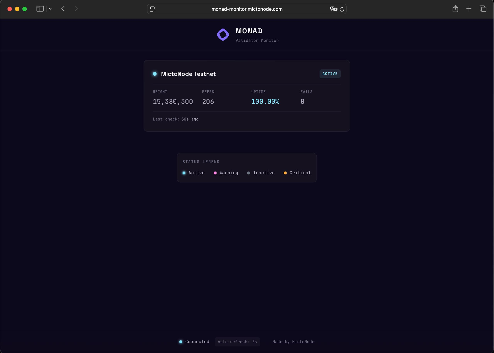

# Monad Validator Monitor

[](https://github.com/MictoNode/micto-monad-monitor)
[](https://python.org)
[](https://docker.com)
[](LICENSE)

> Monitor your Monad validators from a separate server. Get instant alerts when your node goes down, stops producing blocks, or runs low on resources.

**Why remote monitoring?** If your validator crashes, local monitoring dies with it. This runs elsewhere, so you always get alerts.

---

## What's New

- **Web Dashboard** - Real-time status at `http://your-server:8282`
- **Multi-source validation** - Huginn + gmonads API cross-validation
- **Active set tracking** - Know when your validator enters/leaves active set
- **Pushover emergency alerts** - Bypass Do Not Disturb mode
- **Discord webhook support** - Community alerts

---

## Prerequisites

### Docker Installation

If Docker is not installed on your server (both monitor and validator servers need Docker):

```bash
# Install Docker (Ubuntu/Debian)
curl -fsSL https://get.docker.com | sh

# Add your user to docker group (optional, avoids sudo)
sudo usermod -aG docker $USER

# Log out and back in, then verify:
docker --version
docker compose version
```

**Requirements:**
- Docker 20.10+
- Docker Compose v2 (`docker compose` command)
- 512MB RAM minimum (monitor server)
- Internet access to reach your validators

> **Note:** This guide uses Docker Compose v2 commands (`docker compose`). If you're using v1, replace with `docker-compose` (hyphen).

---

## Quick Start (5 minutes)

```bash
# 1. Clone & enter
git clone https://github.com/MictoNode/micto-monad-monitor.git
cd micto-monad-monitor

# 2. Copy example configs
cp config/config.example.yaml config/config.yaml
cp config/validators.example.yaml config/validators.yaml
cp .env.example .env

# 3. Edit configs
nano .env
nano config/validators.yaml
nano config/config.yaml

# 4. Start
docker compose up -d
docker compose logs -f
```

You should get a **"Monad Monitor Started"** message on Telegram.

**Dashboard:** `http://your-server-ip:8282`

---

## What You Get

| Alert Type | When | Channels |
|------------|------|----------|
| **Node Down** | Can't reach metrics or blocks stopped | Telegram + Pushover + Discord |
| **High Resources (Critical)** | CPU/RAM/Disk ≥ 95% | Telegram + Pushover + Discord |
| **High Resources (Warning)** | CPU/RAM/Disk ≥ 90% | Telegram + Discord |
| **Active Set Changes** | Enters or leaves active set | Telegram + Discord |
| **Recovery** | Validator back online | Telegram + Discord |
| **Extended Report** | 6-hour detailed report with uptime | Telegram + Discord |

**Alert Priority:**
- **CRITICAL** → Telegram + Pushover + Discord (bypasses rate limits)
- **WARNING** → Telegram + Discord (rate limited)
- **INFO** → Telegram + Discord (rate limited)

> **Notes:**
> - Pushover: Only CRITICAL alerts (emergency channel), 30-minute cooldown per validator
> - Discord: Optional, receives ALL alerts if configured (same as Telegram)

---

## Setup Guide

### What You Need

- **2 servers:** One for your validator, one for monitoring (can be a cheap VPS)
- **Telegram bot** (free, takes 2 minutes)
- **Discord webhook** (optional ,free, takes 2 minutes)
- **Pushover** (optional but recommended, for emergency alerts that bypass DND)

---

### Step 1: Prepare Your Validator Server

Open these ports to your monitor server IP only:

```bash
MONITOR_IP="1.2.3.4"  # <-- Your monitor server IP

sudo ufw allow from $MONITOR_IP to any port 8889 proto tcp  # Prometheus metrics
sudo ufw allow from $MONITOR_IP to any port 8080 proto tcp  # JSON-RPC
sudo ufw allow from $MONITOR_IP to any port 9100 proto tcp  # Node exporter (optional)
```

#### Optional: System Metrics (CPU/RAM/Disk + TrieDB)

**1. Install TrieDB Collector** (for MonadDB disk usage):

```bash
# Install bc calculator
sudo apt install -y bc

# Create directories
mkdir -p ~/monad-monitoring/scripts
sudo mkdir -p /var/lib/node_exporter/textfile_collector

# Get the collector script
curl -o ~/monad-monitoring/scripts/triedb-collector.sh \
  https://raw.githubusercontent.com/MictoNode/micto-monad-monitor/main/scripts/triedb-collector.sh

chmod +x ~/monad-monitoring/scripts/triedb-collector.sh

# Test - creates .prom file
~/monad-monitoring/scripts/triedb-collector.sh

# Verify
cat /var/lib/node_exporter/textfile_collector/monad_triedb.prom

# Add to crontab (runs every minute)
crontab -e
# Add this line:
* * * * * $HOME/monad-monitoring/scripts/triedb-collector.sh >> /var/log/triedb-collector.log 2>&1
```

**2. Install Node Exporter** (with textfile collector for TrieDB):

```bash
docker run -d \
  --name node-exporter \
  --restart unless-stopped \
  -p 9100:9100 \
  -v /proc:/host/proc:ro \
  -v /sys:/host/sys:ro \
  -v /:/rootfs:ro \
  -v /var/lib/node_exporter/textfile_collector:/textfile_collector \
  prom/node-exporter:latest \
  --path.procfs=/host/proc \
  --path.sysfs=/host/sys \
  --path.rootfs=/rootfs \
  --collector.textfile.directory=/textfile_collector

# Verify (should see both system metrics AND monad_triedb_* metrics)
curl http://localhost:9100/metrics | grep monad_triedb
```

---

### Step 2: Create Telegram Bot

1. Open Telegram, search **@BotFather**
2. Send `/newbot` and follow prompts
3. Save the **token** (looks like `123456789:ABCdef...`)
4. Start a chat with your bot, send any message
5. Get your **chat_id**: Open `https://api.telegram.org/bot<TOKEN>/getUpdates`
6. Find `"chat":{"id":123456789}` - that's your chat_id

**Test:**
```bash
curl -X POST "https://api.telegram.org/bot<TOKEN>/sendMessage" \
  -d "chat_id=<CHAT_ID>&text=Test"
```

---

### Step 3: Pushover (Optional - Recommended)

For alerts that bypass your phone's Do Not Disturb:

1. Go to [pushover.net](https://pushover.net), create account
2. Note your **User Key**
3. Create an app, get **API Token**
4. Install Pushover app on your phone

> $4.99 one-time per device after 30-day trial. Desktop notifications are free.

---

### Step 4: Configure the Monitor

```bash
# 1. Clone & enter
git clone https://github.com/MictoNode/micto-monad-monitor.git
cd micto-monad-monitor

# 2. Copy example configs
cp config/config.example.yaml config/config.yaml
cp config/validators.example.yaml config/validators.yaml
cp .env.example .env
```

#### 4.1 Edit `.env` - Your Credentials

```bash
nano .env
```

| Variable | Required | Description |
|----------|:--------:|-------------|
| `TELEGRAM_TOKEN` | **Yes** | Bot token from @BotFather |
| `TELEGRAM_CHAT_ID` | **Yes** | Your chat ID for alerts |
| `PUSHOVER_USER_KEY` | No | For emergency alerts |
| `PUSHOVER_APP_TOKEN` | No | From pushover.net |
| `DISCORD_WEBHOOK_URL` | No | Discord webhook URL |
| `TZ` | No | Timezone (default: UTC) |

Save: `Ctrl+O`, Exit: `Ctrl+X`

#### 4.2 Edit `validators.yaml` - Your Validators

```bash
nano config/validators.yaml
```

```yaml
validators:
  - name: "My Validator"
    host: "192.168.1.100"
    network: "testnet"
    metrics_port: 8889
    rpc_port: 8080
    node_exporter_port: 9100    # Optional - delete if not using
    validator_secp: "02abc123..."  # 66 chars, starts with 02/03
    enabled: true
```

| Field | Required | Description |
|-------|:--------:|-------------|
| `name` | **Yes** | Display name |
| `host` | **Yes** | Validator IP |
| `network` | **Yes** | `testnet` or `mainnet` |
| `metrics_port` | **Yes** | Default: 8889 |
| `rpc_port` | **Yes** | Default: 8080 |
| `node_exporter_port` | No | Delete if not using system metrics |
| `validator_secp` | **Yes** | 66 chars, starts with 02/03 |
| `enabled` | No | Set to `false` to disable (default: true) |

Save: `Ctrl+O`, Exit: `Ctrl+X`

#### 4.3 Edit `config.yaml` - Settings (Optional)

```bash
nano config/config.yaml
```

Default settings work for most users. Key options:

```yaml
monitoring:
  check_interval: 60           # Seconds between checks
  alert_threshold: 3           # Failures before alerting
  extended_report_interval: 21600  # 6-hour detailed report

thresholds:
  cpu_warning: 90
  cpu_critical: 95
  memory_warning: 90
  memory_critical: 95
  disk_warning: 85
  disk_critical: 95
```

Save: `Ctrl+O`, Exit: `Ctrl+X`

---

### Step 5: Start Monitoring

```bash
docker compose up -d
docker compose logs -f
```

You should see:
```
INFO ✅ My Monad Testnet: In-sync · Height: 15,079,199 · Peers: 204
```

**Done!** Check your Telegram for the startup message.

---

## Dashboard

Your dashboard is running at: `http://your-server-ip:8282`



### Features

Each validator card displays:

| Metric | Description |
|--------|-------------|
| **Status** | ACTIVE / WARNING / INACTIVE / CRITICAL |
| **Height** | Current block height |
| **Peers** | Connected peer count |
| **Uptime** | Huginn uptime percentage |
| **Fails** | Consecutive check failures |

- **5-second auto-refresh** - Real-time updates
- **Status legend** - Color-coded indicators
- **Connection status** - Monitor connectivity badge
- **Responsive design** - Works on mobile, tablet, desktop

### Connect Your Domain (Optional)

1. **Point your domain** (e.g., `monad.yourdomain.com`) to your server IP

2. **Create nginx config:**
   ```bash
   sudo nano /etc/nginx/sites-available/monad-dashboard
   ```

   ```nginx
   server {
       server_name monad.yourdomain.com;

       location / {
           proxy_pass http://localhost:8282;
           proxy_set_header Host $host;
           proxy_set_header X-Real-IP $remote_addr;
           proxy_set_header X-Forwarded-For $proxy_add_x_forwarded_for;
       }

       listen 80;
   }
   ```

3. **Enable & test:**
   ```bash
   sudo ln -s /etc/nginx/sites-available/monad-dashboard /etc/nginx/sites-enabled/
   sudo nginx -t && sudo systemctl reload nginx
   ```

4. **Add SSL (recommended):**
   ```bash
   sudo certbot --nginx -d monad.yourdomain.com
   ```

---

## Architecture

```
┌────────────────────────────────────────┐
│         MONITORING SERVER              │
│                                        │
│  Docker Container                      │
│  ├── Monitor (checks validators)       │
│  ├── Health Server :8181 (internal)    │
│  └── Dashboard Server :8282            │
│                                        │
│  Nginx (optional)                      │
│  └── domain.com → localhost:8282       │
└────────────────┬───────────────────────┘
                 │
    ┌────────────┼────────────┐
    ▼            ▼            ▼
┌────────┐  ┌────────┐  ┌────────┐
│Validator│  │Validator│  │Validator│
│ :8889  │  │ :8889  │  │ :8889  │
│ :8080  │  │ :8080  │  │ :8080  │
│ :9100  │  │ :9100  │  │ :9100  │
└────────┘  └────────┘  └────────┘
```

---

## Troubleshooting

### "Connection failed"

```bash
# Test from monitor server:
curl http://VALIDATOR_IP:8889/metrics

# If timeout:
# 1. Check firewall on validator
# 2. Verify IP in validators.yaml
# 3. Ensure Monad node is running
```

### No Telegram messages

```bash
# Test manually:
curl -X POST "https://api.telegram.org/bot<TOKEN>/sendMessage" \
  -d "chat_id=<CHAT_ID>&text=Test"
```

### Dashboard not loading

```bash
# Check if port is exposed:
docker compose logs | grep 8282

# Verify container is running:
docker compose ps
```

### Too many alerts

```yaml
# In config.yaml:
monitoring:
  alert_threshold: 5  # More failures before alerting
```

### State not persisting (false alerts on restart)

```bash
# Verify volume is mounted:
docker volume ls | grep monitor-state

# Check volume contents:
docker run --rm -v monitor-state:/data alpine ls -la /data
```

---

## Files

```
micto-monad-monitor/
├── .env                    # Your secrets (Telegram, Pushover, etc.)
├── docker-compose.yaml     # Docker config
├── config/
│   ├── config.yaml        # Settings (thresholds, intervals)
│   └── validators.yaml    # Your validators
├── scripts/
│   └── triedb-collector.sh  # TrieDB metrics (run on validator)
└── monad_monitor/
    ├── main.py            # Entry point
    ├── alerts.py          # Telegram, Pushover, Discord
    ├── dashboard_server.py # Web dashboard (:8282)
    ├── health_server.py   # Health API (:8181)
    └── static/            # Dashboard frontend
```

---

## API Endpoints

### Health Server (:8181)

| Endpoint | Description |
|----------|-------------|
| `GET /health` | Full health status (JSON) |
| `GET /ready` | Readiness probe |
| `GET /live` | Liveness probe |
| `GET /metrics` | Prometheus metrics |

### Dashboard Server (:8282)

| Endpoint | Description |
|----------|-------------|
| `GET /` | Web dashboard UI |
| `GET /health` | Health status (JSON) |

---

## External APIs

| API | Purpose | Rate Limit |
|-----|---------|------------|
| [Huginn Tech](https://huginn.tech) | Validator uptime, active set | 5 validators/hour |
| [gmonads.com](https://gmonads.com) | Network TPS, block fullness, fallback | 30 req/min |

---

## Credits

| Source | Purpose |
|--------|---------|
| [Huginn Tech](https://huginn.tech) | Validator uptime, active set detection |
| [gmonads.com](https://gmonads.com) | Network TPS, block fullness, fallback |
| [Staking4all](https://github.com/staking4all/monad-monitoring) | TrieDB collector reference |

---

## Support

- **Issues:** [GitHub Issues](https://github.com/MictoNode/micto-monad-monitor/issues)
- **Updates:** `git pull && docker compose up -d --build`

---

*Made by [MictoNode](https://mictonode.com) - Sleep better knowing your validators are watched.*
