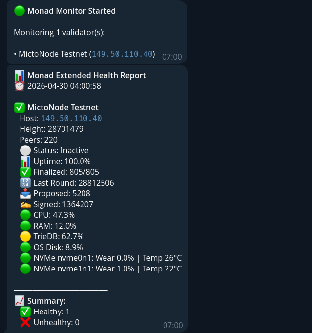
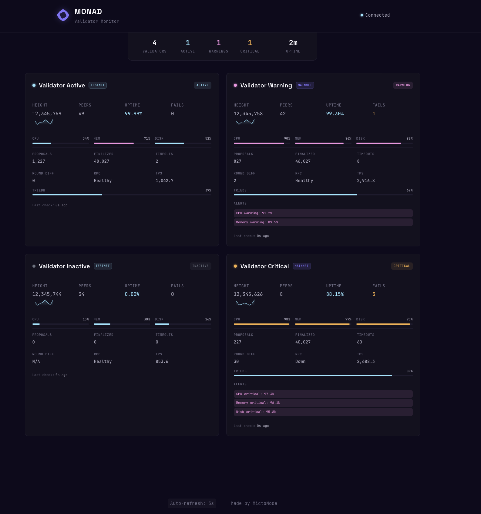
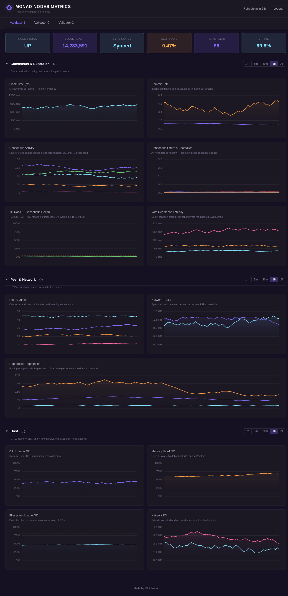

# Monad Validator Monitor

[](https://github.com/MictoNode/micto-monad-monitor)
[](https://python.org)
[](https://docker.com)
[](LICENSE)

> Monitor your Monad validators from a separate server. Get instant alerts when your node goes down, stops producing blocks, or runs low on resources.

**Why remote monitoring?** If your validator crashes, local monitoring dies with it. This runs elsewhere, so you always get alerts.

---

## What's New

- **Metrics Dashboard** - 26 Prometheus charts across 6 sections at `http://your-server:8383`
- **Monitor Dashboard** - Real-time validator status at `http://your-server:8282`
- **Time range selector** - 1m, 5m, 30m, 1h, 24h, 1w, 1mo per chart section
- **Multi-source validation** - Huginn + gmonads API cross-validation
- **Active set tracking** - Know when your validator enters/leaves active set
- **Pushover emergency alerts** - Bypass Do Not Disturb mode
- **Discord webhook support** - Community alerts
- **Slack webhook support** - Team alerts
- **All alert channels optional** - Use any combination of Telegram, Pushover, Discord, Slack
- **Monitor health visibility** - `/health` reports whether the monitor itself is alive, plus per-channel alert delivery counters
- **New version notifications** - Monitor checks GHCR weekly and alerts you (Telegram + Discord + Slack, no Pushover) when a new release is available

---

## Prerequisites

### Docker Installation

If Docker is not installed on your server (both monitor and validator servers need Docker):

```bash
# Install Docker (Ubuntu/Debian)
curl -fsSL https://get.docker.com | sh

# Add your user to docker group (optional, avoids sudo)
sudo usermod -aG docker $USER

# Log out and back in, then verify:
docker --version
docker compose version
```

**Requirements:**
- Docker 20.10+
- Docker Compose v2 (`docker compose` command)
- 512MB RAM minimum (monitor server)
- Internet access to reach your validators

> **Note:** This guide uses Docker Compose v2 commands (`docker compose`). If you're using v1, replace with `docker-compose` (hyphen).

---

## Quick Start (5 minutes)

```bash
# 1. Clone & enter
git clone https://github.com/MictoNode/micto-monad-monitor.git
cd micto-monad-monitor

# 2. Copy example configs
cp config/config.example.yaml config/config.yaml
cp config/validators.example.yaml config/validators.yaml
cp .env.example .env

# 3. Edit configs
nano .env
nano config/validators.yaml
nano config/config.yaml

# 4. Start (uses pre-built image from GHCR)
docker compose up -d
docker compose logs -f
```

> **Want to build from source?** Uncomment `build: .` and comment out the `image:` line in `docker-compose.yaml`, then run `docker compose up -d --build`.

You should get a **"Monad Monitor Started"** message on your configured alert channel(s).

**Monitor Dashboard:** `http://your-server-ip:8282` — Real-time validator status
**Metrics Dashboard:** `http://your-server-ip:8383` — Prometheus charts (requires `DASHBOARD_PASSWORD` + `DASHBOARD_JWT_SECRET` in `.env`)

---

## What You Get

| Alert Type | When | Channels |
|------------|------|----------|
| **Node Down** | Can't reach metrics or blocks stopped | Telegram + Pushover + Discord + Slack |
| **Network Timeout** | Missed rounds seen by network (Huginn), increase ≥ `huginn_timeout_alert_threshold` | Telegram + Pushover + Discord + Slack |
| **High Resources (Critical)** | CPU/RAM/Disk ≥ 95% | Telegram + Pushover + Discord + Slack |
| **High Resources (Warning)** | CPU/RAM ≥ 90%, disk ≥ 85% | Telegram + Discord + Slack |
| **NVMe Wear** | Wear ≥ 70% (warning) or ≥ 95% (critical), from node_exporter SMART metrics | Warning → Telegram + Discord + Slack; Critical → Telegram + Pushover + Discord + Slack |
| **Active Set Changes** | Enters or leaves the active set; the LEFT message notes when the validator is already queued to return at the next epoch | Telegram + Discord + Slack |
| **Active Set Exit Warning** | Your validator is listed to leave the active set at the next epoch boundary (`monitoring.validator_set_warning`, on by default). Sent once per pending exit, with the expected exit time when it can be derived - the time is left out while the network is in a delay period, because the transition slips by definition. On testnet the message notes that rotation is routine and often reverses | Telegram + Discord + Slack |
| **Active Set Entry Notice** | Your validator is queued to (re)join the active set at the next epoch boundary (`monitoring.validator_set_entry_notice`, on by default). Sent once per pending return, with the expected time when it can be derived. A return already announced inside a LEFT alert is not announced again | Telegram + Discord + Slack |
| **Channel Degraded** | An alert channel keeps failing; you are warned through the channels that still work | Telegram + Discord + Slack |
| **Recovery** | Validator back online | Telegram + Discord + Slack |
| **Extended Report** | 6-hour detailed report with 24h, 30d and all-time uptime | Telegram + Discord + Slack |

**Alert Priority:**
- **CRITICAL** → Telegram + Pushover + Discord + Slack (bypasses rate limits)
- **WARNING** → Telegram + Discord + Slack (rate limited)
- **INFO** → Telegram + Discord + Slack (rate limited)

> **Notes:**
> - All channels are optional — configure any combination
> - Pushover: Only CRITICAL alerts (emergency channel), 30-minute cooldown per validator
> - Discord/Slack: Optional, receives ALL alerts if configured
> - **Active-set changes need a verified verdict.** If neither Huginn nor
>   gmonads can tell whether the validator is in the active set, the monitor
>   keeps the last known state rather than guessing; health, resource and
>   network-timeout alerts keep working. A setup that disables both sources
>   gets no active-set transitions at all.

---

## Setup Guide

### What You Need

- **2 servers:** One for your validator, one for monitoring (can be a cheap VPS)
- **Telegram bot** (free, takes 2 minutes)
- **Discord webhook** (optional, free, takes 2 minutes)
- **Slack webhook** (optional, free, takes 2 minutes)
- **Pushover** (optional but recommended, for emergency alerts that bypass DND)

---

### Step 1: Prepare Your Validator Server

Open these ports to your monitor server IP only:

```bash
MONITOR_IP="1.2.3.4"  # <-- Your monitor server IP

sudo ufw allow from $MONITOR_IP to any port 8889 proto tcp  # Prometheus metrics
sudo ufw allow from $MONITOR_IP to any port 8080 proto tcp  # JSON-RPC
sudo ufw allow from $MONITOR_IP to any port 9100 proto tcp  # Node exporter (optional)
```

#### Optional: System Metrics (CPU/RAM/Disk + TrieDB)

**1. Install TrieDB Collector** (for MonadDB disk usage):

```bash
# Install bc calculator
sudo apt install -y bc

# Create directories
mkdir -p ~/monad-monitoring/scripts
sudo mkdir -p /var/lib/node_exporter/textfile_collector

# Get the collector script
curl -o ~/monad-monitoring/scripts/triedb-collector.sh \
  https://raw.githubusercontent.com/MictoNode/micto-monad-monitor/main/scripts/triedb-collector.sh

chmod +x ~/monad-monitoring/scripts/triedb-collector.sh

# Test - creates .prom file
~/monad-monitoring/scripts/triedb-collector.sh

# Verify
cat /var/lib/node_exporter/textfile_collector/monad_triedb.prom

# Add to crontab (runs every minute)
crontab -e
# Add this line:
* * * * * $HOME/monad-monitoring/scripts/triedb-collector.sh >> /var/log/triedb-collector.log 2>&1
```

**2. Install Node Exporter** (with textfile collector for TrieDB):

```bash
docker run -d \
  --name node-exporter \
  --restart unless-stopped \
  --network=host \
  -v /proc:/host/proc:ro \
  -v /sys:/host/sys:ro \
  -v /:/rootfs:ro \
  -v /var/lib/node_exporter/textfile_collector:/textfile_collector \
  prom/node-exporter:latest \
  --path.procfs=/host/proc \
  --path.sysfs=/host/sys \
  --path.rootfs=/rootfs \
  --web.listen-address=:9100 \
  --collector.textfile.directory=/textfile_collector

# Verify (should see both system metrics AND monad_triedb_* metrics)
curl http://localhost:9100/metrics | grep monad_triedb

> **Note:** To use a different port, change `--web.listen-address=:9100` to your desired port (e.g. `:9200`).
> Don't forget to also update `node_exporter_port` in `validators.yaml` to match.
```

> **Note:** `--network=host` is required for correct network interface names.
> Without it, node_exporter reports the container's virtual `eth0` instead of
> real host interfaces (e.g. `enp5s0`). Port mapping (`-p`) is not needed in
> host mode — the container listens directly on the host's port 9100.

---

### Step 2: Create Telegram Bot

1. Open Telegram, search **@BotFather**
2. Send `/newbot` and follow prompts
3. Save the **token** (looks like `123456789:ABCdef...`)
4. Start a chat with your bot, send any message
5. Get your **chat_id**: Open `https://api.telegram.org/bot<TOKEN>/getUpdates`
6. Find `"chat":{"id":123456789}` - that's your chat_id

**Test:**
```bash
curl -X POST "https://api.telegram.org/bot<TOKEN>/sendMessage" \
  -d "chat_id=<CHAT_ID>&text=Test"
```

---

### Step 3: Pushover (Optional - Recommended)

For alerts that bypass your phone's Do Not Disturb:

1. Go to [pushover.net](https://pushover.net), create account
2. Note your **User Key**
3. Create an app, get **API Token**
4. Install Pushover app on your phone

> $4.99 one-time per device after 30-day trial. Desktop notifications are free.

---

### Step 4: Configure the Monitor

```bash
# 1. Clone & enter
git clone https://github.com/MictoNode/micto-monad-monitor.git
cd micto-monad-monitor

# 2. Copy example configs
cp config/config.example.yaml config/config.yaml
cp config/validators.example.yaml config/validators.yaml
cp .env.example .env
```

> **Want to build from source?** Uncomment `build: .` and comment out the `image:` line in `docker-compose.yaml`, then run `docker compose up -d --build`.

#### 4.1 Edit `.env` - Your Credentials

```bash
nano .env
```

| Variable | Required | Description |
|----------|:--------:|-------------|
| `TELEGRAM_TOKEN` | No | Bot token from @BotFather |
| `TELEGRAM_CHAT_ID` | No | Your chat ID for alerts |
| `PUSHOVER_USER_KEY` | No | For emergency alerts |
| `PUSHOVER_APP_TOKEN` | No | From pushover.net |
| `DISCORD_WEBHOOK_URL` | No | Discord webhook URL |
| `SLACK_WEBHOOK_URL` | No | Slack incoming webhook URL |
| `DASHBOARD_PASSWORD` | No | Metrics dashboard password (empty = disabled) |
| `DASHBOARD_JWT_SECRET` | No | JWT secret for metrics dashboard (`openssl rand -hex 32`) |
| `TZ` | No | Timezone (default: UTC) |
| `HEALTH_PORT` | No | Overrides `health_server.port` (default 8181) |
| `DASHBOARD_PORT` | No | Overrides `dashboard_server.port` (default 8282) |
| `API_PORT` | No | Metrics dashboard port (default 8383) |

> At least one alert channel must be configured.
> Metrics Dashboard requires both `DASHBOARD_PASSWORD` and `DASHBOARD_JWT_SECRET` to be set.
> The three port variables are always passed by `docker-compose.yaml`, so they win over the ports in `config.yaml` — change them here, not there. If you change `HEALTH_PORT`, update the compose healthcheck too.

Save: `Ctrl+O`, Exit: `Ctrl+X`

#### 4.2 Edit `validators.yaml` - Your Validators

```bash
nano config/validators.yaml
```

```yaml
validators:
  - name: "My Validator"
    host: "192.168.1.100"
    network: "testnet"
    metrics_port: 8889
    rpc_port: 8080
    node_exporter_port: 9100    # Optional - delete if not using
    validator_secp: "02abc123..."  # 66 chars, starts with 02/03
    enabled: true
```

| Field | Required | Description |
|-------|:--------:|-------------|
| `name` | **Yes** | Display name |
| `host` | **Yes** | Validator IP |
| `network` | **Yes** | `testnet` or `mainnet` |
| `metrics_port` | **Yes** | 8889; use 9143 on Monad ≥ v0.16.2 (see the metrics-port migration note) |
| `rpc_port` | **Yes** | Default: 8080 |
| `node_exporter_port` | No | Delete if not using system metrics |
| `validator_secp` | **Yes** | 66 chars, starts with 02/03 |
| `enabled` | No | Set to `false` to disable (default: true) |

Save: `Ctrl+O`, Exit: `Ctrl+X`

#### 4.3 Edit `config.yaml` - Settings (Optional)

```bash
nano config/config.yaml
```

Default settings work for most users. Key options:

```yaml
monitoring:
  check_interval: 60           # Seconds between checks
  alert_threshold: 3           # Failures before alerting
  huginn_timeout_alert_threshold: 3  # Min missed rounds seen by network before CRITICAL (per check window)
  validator_set_warning: true  # WARN when Huginn staking data shows your validator leaving the active set next epoch
  validator_set_entry_notice: true  # INFO when Huginn staking data shows your validator queued to re-enter next epoch
  extended_report_interval: 21600  # 6-hour detailed report

thresholds:
  cpu_warning: 90
  cpu_critical: 95
  memory_warning: 90
  memory_critical: 95
  disk_warning: 85
  disk_critical: 95

# New version update check (weekly)
updates:
  enabled: true             # Set to false to disable
  check_interval: 604800    # Check frequency in seconds (default: weekly)
  image: "ghcr.io/mictonode/micto-monad-monitor"

health_server:
  port: 8181
  staleness_threshold: 300  # Seconds without a check before /health returns 503
```

The monitor checks the published image tags on GHCR weekly. When a newer release is found, it sends a notification **once** to Telegram, Discord and Slack (Pushover is excluded - reserved for critical alerts) with the update command.

Save: `Ctrl+O`, Exit: `Ctrl+X`

---

### Step 5: Start Monitoring

```bash
docker compose up -d
docker compose logs -f
```

You should see:
```
INFO ✅ My Monad Testnet: In-sync · Height: 15,079,199 · Peers: 204
```

**Done!** Check your Telegram for the startup message.



---

## Monitor Dashboard

Real-time validator status overview at: `http://your-server-ip:8282`



### Features

Each validator card displays:

| Metric | Description |
|--------|-------------|
| **Status** | ACTIVE / WARNING / INACTIVE / CRITICAL |
| **Height** | Current block height |
| **Peers** | Connected peer count |
| **Uptime (24h)** | Huginn participation for the rolling 24h window; the card also shows the 30d and all-time percentages, cumulative finalized/timeout counts, and Huginn/gmonads liveness in the footer |
| **Fails** | Consecutive check failures |

- **5-second auto-refresh** - Real-time updates
- **Status legend** - Color-coded indicators
- **Connection status** - Monitor connectivity badge
- **Responsive design** - Works on mobile, tablet, desktop

### Connect Your Domain (Optional)

1. **Point your domain** (e.g., `monad-monitor.yourdomain.com`) to your server IP

2. **Create nginx config:**
   ```bash
   sudo nano /etc/nginx/sites-available/monad-monitor
   ```

   ```nginx
   server {
       server_name monad-monitor.yourdomain.com;

       location / {
           proxy_pass http://localhost:8282;
           proxy_set_header Host $host;
           proxy_set_header X-Real-IP $remote_addr;
           proxy_set_header X-Forwarded-For $proxy_add_x_forwarded_for;
       }

       listen 80;
   }
   ```

3. **Enable & test:**
   ```bash
   sudo ln -s /etc/nginx/sites-available/monad-monitor /etc/nginx/sites-enabled/
   sudo nginx -t && sudo systemctl reload nginx
   ```

4. **Add SSL (recommended):**
   ```bash
   sudo certbot --nginx -d monad-monitor.yourdomain.com
   ```

---

## Metrics Dashboard

Production-grade metrics dashboard with Prometheus time-series charts at `http://your-server-ip:8383`.



### Setup

1. Add to your `.env` file (see Step 4.1):
   ```env
   DASHBOARD_PASSWORD=your_secure_password
   DASHBOARD_JWT_SECRET=<generate with: openssl rand -hex 32>
   ```

2. Restart services:
   ```bash
   docker compose up -d
   ```

3. Open `http://your-server:8383` and enter your password.

> Prometheus starts automatically with `docker compose up` and scrapes each validator on the `metrics_port` and (if set) `node_exporter_port` from `validators.yaml`.

### Overview

After login, the dashboard shows **9 stat boxes** and **26 time-series charts** across **6 collapsible sections**:

| Stat Box | Description |
|----------|-------------|
| **Node Status** | UP / DOWN with checkmark indicator |
| **Block Height** | Current block height |
| **Sync Status** | In-sync / behind percentage |
| **Self Stake** | Your validator's stake percentage |
| **Total Peers** | Connected peer count |
| **Node Runtime** | How long the validator node process has been running (from Monad metrics, not Huginn uptime) |
| **Proposals** | Block proposals created by the validator |
| **Committed Blocks** | Blocks committed by the validator |
| **Local Timeouts** | Local consensus timeouts observed on this node |

### Chart Sections

| Section | Charts | What You See |
|---------|:------:|--------------|
| **Consensus & Execution** | 7 | Block height, time, commit rate, proposals, TC ratio, leader changes |
| **Peer & Network** | 3 | Connected peers, network I/O per interface |
| **Raptorcast** | 4 | Decoding rate, cache hit ratio, queue depth, insertions |
| **Txpool** | 3 | Pending/queued transactions, gas pricing |
| **Host** | 8 | CPU, memory, load, disk I/O, filesystem usage, NVMe temperature & wear level |
| **TrieDB** | 1 | Fast/slow/free tier distribution |

### Features

- **Per-section time range selector** — 1m, 5m, 30m, 1h, 24h, 1w, 1mo (independent per section)
- **Tab-based validator selection** — One tab per configured validator
- **Threshold lines** — Visual markers on block time, disk usage, NVMe temp & wear
- **Multi-device support** — NVMe chips, disk devices, mountpoints, network interfaces shown separately
- **30-second auto-refresh** — With countdown, pauses when tab is hidden
- **JWT authentication** — httpOnly cookie, 24-hour expiry, password-protected
- **Purple dark theme** — Consistent design across both dashboards
- **Unit-formatted tooltips** — ms, %, bytes, ops/s displayed correctly
- **Responsive design** — Works on mobile, tablet, desktop

### Connect Your Domain (Optional)

1. **Point your domain** (e.g., `monad-metrics.yourdomain.com`) to your server IP

2. **Create nginx config:**
   ```bash
   sudo nano /etc/nginx/sites-available/monad-metrics
   ```

   ```nginx
   server {
       server_name monad-metrics.yourdomain.com;

       location / {
           proxy_pass http://localhost:8383;
           proxy_set_header Host $host;
           proxy_set_header X-Real-IP $remote_addr;
           proxy_set_header X-Forwarded-For $proxy_add_x_forwarded_for;
       }

       listen 80;
   }
   ```

3. **Enable & test:**
   ```bash
   sudo ln -s /etc/nginx/sites-available/monad-metrics /etc/nginx/sites-enabled/
   sudo nginx -t && sudo systemctl reload nginx
   ```

4. **Add SSL (recommended):**
   ```bash
   sudo certbot --nginx -d monad-metrics.yourdomain.com
   ```

### Disable

Leave `DASHBOARD_PASSWORD` and `DASHBOARD_JWT_SECRET` empty (or remove them) to disable the metrics dashboard. All other services continue normally.

---

## Architecture

```
┌─────────────────────────────────────────────────┐
│              MONITORING SERVER                   │
│                                                  │
│  Docker Compose                                 │
│  ├── Monitor Container                          │
│  │   ├── Monitor (checks validators)            │
│  │   ├── Health Server :8181                    │
│  │   ├── Monitor Dashboard :8282                │
│  │   └── Metrics Dashboard :8383 (FastAPI)      │
│  │                                               │
│  └── Prometheus Container :9090 (30d retention) │
│                                                  │
│  Nginx (optional)                               │
│  ├── monad-monitor.domain.com → :8282           │
│  └── monad-metrics.domain.com  → :8383          │
└────────────────────┬────────────────────────────┘
                     │
       ┌─────────────┼─────────────┐
       ▼             ▼             ▼
┌──────────┐  ┌──────────┐  ┌──────────┐
│Validator │  │Validator │  │Validator │
│ :8889    │  │ :8889    │  │ :8889    │
│ :8080    │  │ :8080    │  │ :8080    │
│ :9100    │  │ :9100    │  │ :9100    │
└──────────┘  └──────────┘  └──────────┘
```

> All four ports (8181, 8282, 8383, 9090) are published on the monitor host. Only
> the dashboards need to be reachable from outside (through your reverse proxy);
> restrict 8181 and 9090 to your own network.

---

## Troubleshooting

### "Connection failed"

```bash
# Test from monitor server:
curl http://VALIDATOR_IP:8889/metrics

# If timeout:
# 1. Check firewall on validator
# 2. Verify IP in validators.yaml
# 3. Ensure Monad node is running
```

### No Telegram messages

```bash
# Test manually:
curl -X POST "https://api.telegram.org/bot<TOKEN>/sendMessage" \
  -d "chat_id=<CHAT_ID>&text=Test"
```

### Dashboard not loading

```bash
# Check container logs:
docker compose logs | grep -E "8282|8383"

# Verify containers are running:
docker compose ps

# Metrics dashboard not working? Check env vars:
docker compose exec monitor env | grep DASHBOARD
```

### Too many alerts

```yaml
# In config.yaml:
monitoring:
  alert_threshold: 5  # More failures before alerting
  huginn_timeout_alert_threshold: 3  # Only alert when 3+ missed rounds accumulate per check window (network timeouts)
```

### Container shows unhealthy / healthcheck failing

```bash
# /health returns 503 when the monitor has not finished a check for a while
curl -s localhost:8181/health | jq '{freshness, check_age_seconds, status}'
```

`freshness: "stale"` means the monitor loop stopped making progress (a hung
check, or a host-level problem) - look at `docker compose logs` next. A validator
being down does **not** make the container unhealthy; that shows in `status`.

### State not persisting (false alerts on restart)

```bash
# Verify volume is mounted:
docker volume ls | grep monitor-state

# Check volume contents:
docker run --rm -v monitor-state:/data alpine ls -la /data
```

---

## Files

```
micto-monad-monitor/
├── .env                        # Your secrets (Telegram, Pushover, etc.)
├── docker-compose.yaml         # Docker config
├── config/
│   ├── config.yaml            # Settings (thresholds, intervals)
│   └── validators.yaml        # Your validators
├── scripts/
│   ├── triedb-collector.sh    # TrieDB + NVMe metrics (run on validator)
│   ├── generate_targets.py    # Writes the Prometheus target file
│   └── entrypoint.sh          # Container startup
└── monad_monitor/
    ├── main.py                # Entry point
    ├── alerts.py              # Telegram, Pushover, Discord, Slack
    ├── dashboard_server.py    # Monitor dashboard (:8282)
    ├── api_server.py          # Metrics dashboard API (:8383)
    ├── health_server.py       # Health API (:8181)
    ├── static/                # Monitor dashboard frontend
    └── static_dashboard/      # Metrics dashboard frontend (Chart.js)
```

---

## API Endpoints

### Health Server (:8181)

| Endpoint | Description |
|----------|-------------|
| `GET /health` | Process freshness + validator status (JSON) |
| `GET /ready` | Readiness probe |
| `GET /live` | Liveness probe |
| `GET /metrics` | Prometheus metrics |

`/health` reports the **monitor's own health**: `200` while it is checking your
validators, `503` if it has stopped checking (no tick within
`health_server.staleness_threshold`, default 300 seconds). Validator state is in
the body rather than the status code, so a validator problem never marks the
monitoring container unhealthy — point any watchdog (healthchecks.io,
UptimeRobot, an orchestrator) at `/health` and it means what it says:

```json
{
  "status": "healthy",              // validator aggregate: healthy | unhealthy | unknown
  "freshness": "ok",                // ok | stale | unknown
  "check_age_seconds": 0.8,         // seconds since the last check
  "uptime_seconds": 3600.5,
  "version": "v1.7.9",
  "validators": { "...": {} },
  "alerts": {                       // per-channel delivery counters
    "telegram": {"sent": 12, "failed": 0, "consecutive_failures": 0},
    "pushover": {"sent": 1, "failed": 0, "consecutive_failures": 0},
    "discord": {"sent": 12, "failed": 0, "consecutive_failures": 0},
    "slack": {"sent": 0, "failed": 0, "consecutive_failures": 0}
  }
}
```

The `alerts` counters show whether each channel is really delivering: if one
keeps failing, the monitor warns you once through the channels that still work.
A CRITICAL that no channel accepted is retried automatically, and the queue
survives restarts (kept in `/app/state`).

### Monitor Dashboard (:8282)

| Endpoint | Description |
|----------|-------------|
| `GET /` | Web dashboard UI |
| `GET /health` | Validator data + monitor freshness (JSON, always `200`) |

This is the endpoint the web UI polls every 5 seconds, so it always answers
`200`; it carries the same `freshness` / `check_age_seconds` fields as the health
server, which makes it usable from outside as well (it is the endpoint exposed
through a reverse proxy in a typical deployment).

### Metrics Dashboard (:8383)

| Endpoint | Description |
|----------|-------------|
| `POST /api/auth/login` | Login with password, returns JWT cookie |
| `POST /api/auth/logout` | Clear JWT cookie |
| `GET /api/health` | Prometheus connectivity check |
| `GET /api/validators` | List configured validators |
| `GET /api/overview` | Latest values for every configured validator (dashboard stat boxes) |
| `GET /api/metrics/{name}` | Raw metric values for a validator |
| `GET /api/chart/{name}/{key}?range=1h` | Time-series chart data (ranges: 1m, 5m, 30m, 1h, 24h, 1w, 1mo) |

---

## External APIs

| API | Purpose | Rate Limit |
|-----|---------|------------|
| [Huginn Tech](https://huginn.tech) | Validator uptime (24h, 30d, all-time), active-set status, next-epoch exit warnings | No documented per-validator limit; the staking endpoints (`/staking/validator-set`, `/validators`) share **60 req/min/IP** and the monitor caches to stay well inside it |
| [gmonads.com](https://gmonads.com) | Network TPS, block fullness, fallback | 30 req/min |

---

## Credits

| Source | Purpose |
|--------|---------|
| [Huginn Tech](https://huginn.tech) | Validator uptime, active set detection |
| [gmonads.com](https://gmonads.com) | Network TPS, block fullness, fallback |
| [Staking4all](https://github.com/staking4all/monad-monitoring) | TrieDB collector reference |

---

## Updating

### General Update Steps

Every update follows the same pattern:

```bash
# 1. Pull the latest version
docker compose pull          # Pre-built image (GHCR)
# — OR —
git pull                     # Build from source

# 2. Stop and restart
docker compose up -d

# 3. Verify
docker compose logs -f
```

> State files in `/app/state` are preserved across updates via Docker volume. No backup needed.

After updating, compare your local config files (`config/config.yaml`, `config/validators.yaml`, `.env`, `docker-compose.yaml`) with the `.example` files — new releases can add config keys (e.g. `huginn_timeout_alert_threshold`) that you may want to set.

### Pre-built vs Source

| Method | Command | Use When |
|--------|---------|----------|
| **Pre-built (recommended)** | `docker compose pull && docker compose up -d` | Using GHCR image |
| **Build from source** | `git pull && docker compose up -d --build` | Uncommented `build: .` in docker-compose.yaml |

> **Note:** When building from source, the new-version notification uses `MONITOR_VERSION`, which defaults to `0.0.0`. Unless you bake your real version in (e.g. `docker compose build --build-arg MONITOR_VERSION=1.4.9`), any published release will be reported as new. Pre-built GHCR images already carry the correct version.

#### Monad v0.16.2+ — Metrics Port Migration (informational)

Monad is moving validator metrics from **push** (an OTEL collector re-exposing everything on `:8889`) to **pull**:

- Since **v0.16.2** the node process itself publishes its metrics on **`:9143/metrics`** — the collector is no longer needed on the node side.
- Monad Foundation will scrape your endpoint directly once the migration completes; `:8889` (OTEL collector) will be retired.
- **You do not have to change anything yet.** Keep pushing metrics to MF as you do today, and keep `metrics_port: 8889` until MF announces the cut-over.

**When you switch**, point the validator's `metrics_port` at `9143` in `validators.yaml` and restart the monitor container (Prometheus targets are rewritten at container start):

```yaml
validators:
  - name: "Monad Testnet #1"
    metrics_port: 9143      # node-published metrics (Monad >= 0.16.2)
```

**Coverage:** `:9143` serves every metric family the monitor charts, so the switch costs no chart (the RPC charts that needed `:8889` were removed in v1.7.2).

**Firewall:** keep `:8889` and `:9143` reachable **only from your monitor server** — metrics have no reason to be public. When MF switches to pull, add MF's scraper IPs as well.

**What does *not* change:** the TrieDB + NVMe SMART collector script (`scripts/triedb-collector.sh` → node_exporter text-file metrics on `:9100`) stays in use — it carries the fast/slow/free tier breakdown and NVMe wear/temperature.

### Version-Specific Steps

#### v1.3.0 → v1.4.0

This update adds the **Metrics Dashboard** (:8383) with Prometheus charts. It's optional — your existing setup continues to work without any config changes.

**New features:**
- Metrics Dashboard with Prometheus charts (27 at the time - the RPC section was removed in v1.7.2, leaving the 26 charted today)
- Prometheus container (auto-starts with `docker compose up`)
- Time range selector per chart section (1m, 5m, 30m, 1h, 24h, 1w, 1mo)
- Per-method RPC latency charts
- NVMe temperature and wear level monitoring
- Purple dark theme across both dashboards

**Steps:**

**On your validator server:**

```bash
# 1. Update the TrieDB collector script (adds NVMe SMART metrics)
curl -o ~/monad-monitoring/scripts/triedb-collector.sh \
  https://raw.githubusercontent.com/MictoNode/micto-monad-monitor/main/scripts/triedb-collector.sh
chmod +x ~/monad-monitoring/scripts/triedb-collector.sh

# 2. Recreate node-exporter with --network=host (required for correct interface names)
docker stop node-exporter && docker rm node-exporter
docker run -d \
  --name node-exporter \
  --restart unless-stopped \
  --network=host \
  -v /proc:/host/proc:ro \
  -v /sys:/host/sys:ro \
  -v /:/rootfs:ro \
  -v /var/lib/node_exporter/textfile_collector:/textfile_collector \
  prom/node-exporter:latest \
  --path.procfs=/host/proc \
  --path.sysfs=/host/sys \
  --path.rootfs=/rootfs \
  --web.listen-address=:9100 \
  --collector.textfile.directory=/textfile_collector
```

> **Note:** To use a different port, change `--web.listen-address=:9100` to your desired port (e.g. `:9200`).
> Don't forget to also update `node_exporter_port` in `validators.yaml` to match.

**On your monitor server:**

```bash
# 3. Pull updated config files (required — adds Prometheus service + config)
cd ~/micto-monad-monitor    # your monitor directory
git pull

# 4. Pull latest image
docker compose pull

# 5. (Optional) Enable Metrics Dashboard — add to your .env:
#    DASHBOARD_PASSWORD=your_secure_password
#    DASHBOARD_JWT_SECRET=<generate with: openssl rand -hex 32>
nano .env

# 6. Start all services (monitor + Prometheus)
docker compose up -d

# 7. Verify — check that both containers are running:
docker compose ps
```

**What changes automatically:**
- Prometheus container starts and scrapes `:8889` and `:9100`
- Prometheus data stored in Docker volume (`prometheus-data`), 30-day retention
- Monitor Dashboard (:8282) and Health Server (:8181) unchanged

**No action needed if you don't want the Metrics Dashboard** — it stays disabled when `DASHBOARD_PASSWORD` is empty.

#### v1.7.2 — RPC metrics section removed

The metrics dashboard no longer carries an **RPC** section (the 5 charts: active requests, execution duration, call rate per method, wait time, per-method latency).

**Unchanged:**
- The RPC **health check** (`rpc_port: 8080` → `RPC: Healthy / Down` in the card details)
- Network **TPS** (gmonads) and **tx throughput** (`monad_execution_ledger_num_tx_commits` in the Commit Rate chart)

**No config change required.** Keep `metrics_port: 8889` until MF announces the cut-over; after that, `9143` works with no chart loss.

---

## Support

- **Issues:** [GitHub Issues](https://github.com/MictoNode/micto-monad-monitor/issues)

---

*Made by [MictoNode](https://mictonode.com) - Sleep better knowing your validators are watched.*
